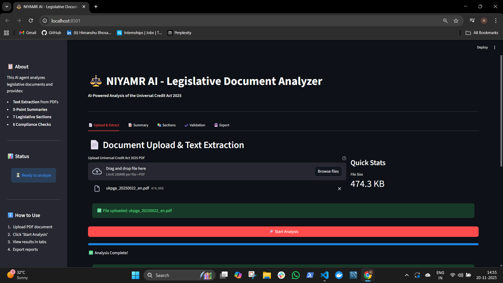
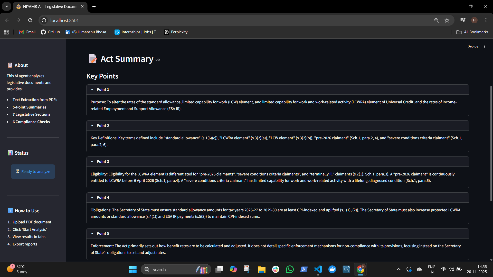
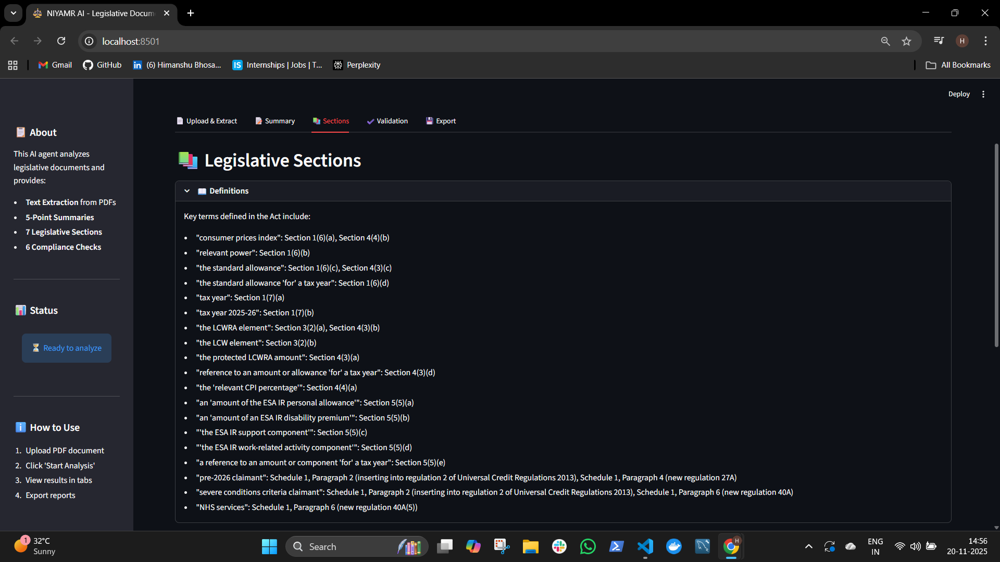
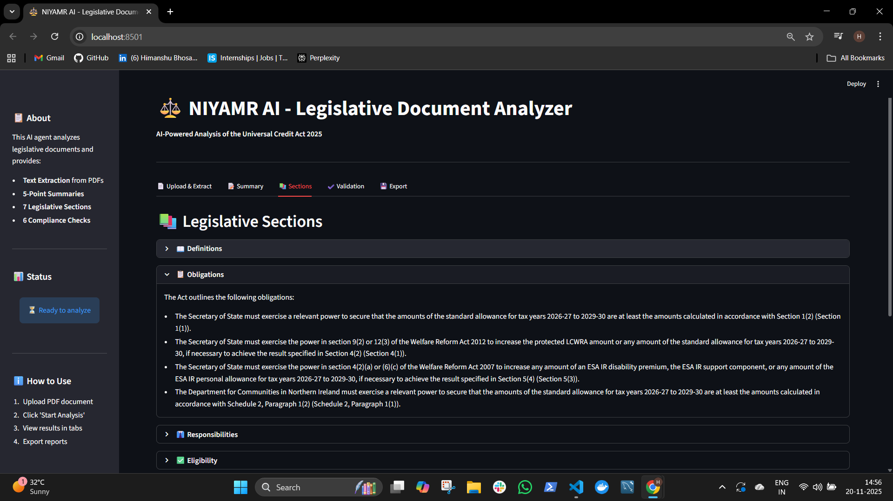
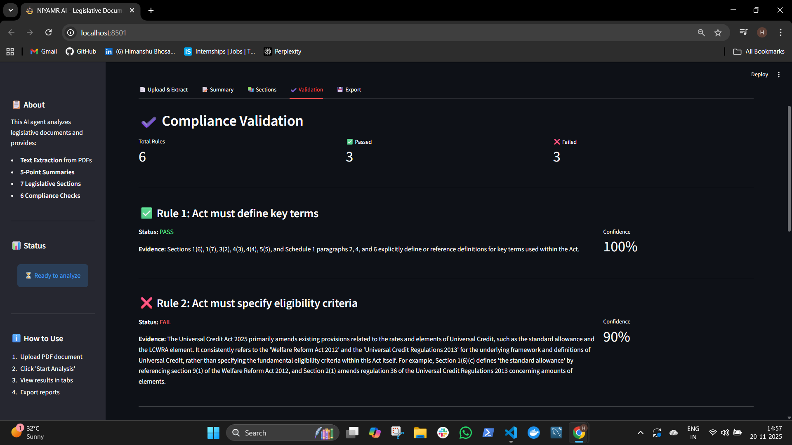
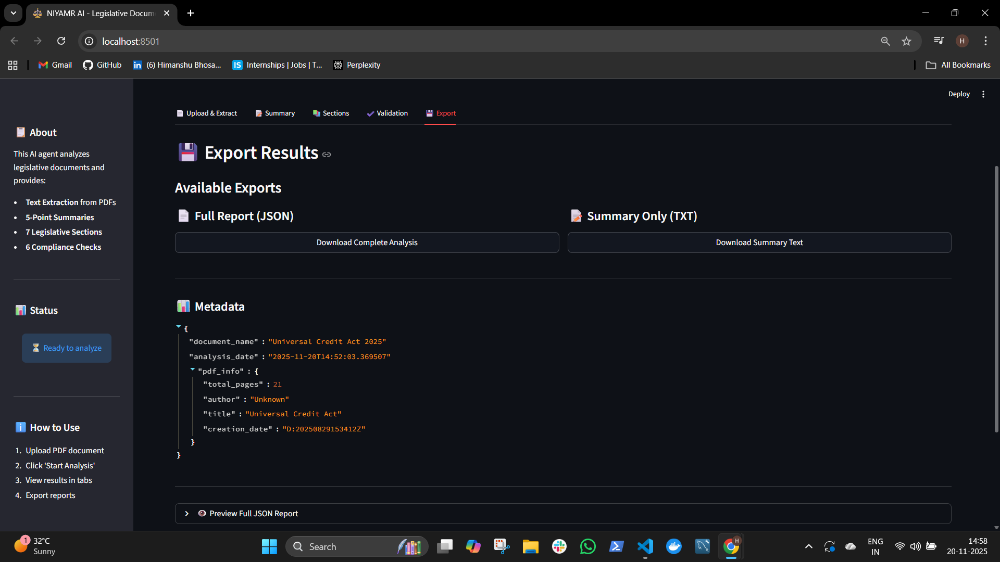

**Universal Credit Act 2025 Analyzer**
======================================

📌 **Project Overview**
-----------------------

This project implements an AI-powered document analysis agent that **extracts**, **summarizes**, and **validates** legislative documents. The system processes the Universal Credit Act 2025 PDF and generates comprehensive structured JSON reports with compliance validation.

The agent uses **LangChain**, **Google Gemini AI**, and **pdfplumber** to provide accurate, citation-backed analysis of legal documents with sophisticated rule-based validation.

🎯 **Key Features**
-------------------

✔️ **PDF Text Extraction**: Clean, structured text extraction from legislative PDFs using pdfplumber.

✔️ **AI-Powered Summarization**: 5-10 bullet point summaries covering purpose, definitions, eligibility, obligations, and enforcement

✔️ **Legislative Section Extraction**: Automated extraction of 7 key categories (definitions, obligations, responsibilities, eligibility, payments, penalties, record-keeping)

✔️  **Rule Validation Engine**: 6 compliance checks with evidence citations and confidence scoring

✔️ **Structured JSON Output**: Machine-readable reports with complete metadata and analysis results

✔️  **LangChain Integration**: Modern orchestration with Google Gemini 1.5 Flash for optimal performance

✔️  **Interactive Web UI**: Beautiful Streamlit interface for easy document upload and analysis

🏗 **Project Structure**
------------------------

```   Task/  
│  
├── 📂 src/  
│   ├── 📜 __init__.py  
│   ├── 📜 pdf_extractor.py        # Task 1: PDF text extraction 
│   ├── 📜 gemini_analyzer.py      # Tasks 2-4: AI-powered analysis 
│   ├── 📜 json_compiler.py        # Final JSON report compilation
│   
├── 📂 data/  
│   └── 📜 ukpga_20250022_en.pdf   # Universal Credit Act 2025
│  
├── 📂 output/  
|    └── final_report.json          # Structured analysis report
|    └── extracted_text.txt         # Full extracted text
|
├── 📜 main.py                      # Main 
├── 📜 streamlit_app.py             # Streamlit frontend 
├── 📜 pyproject.toml               # UV dependencies
├── 📜 .env                         # API configuration
├── 📜 .env.example                 # Environment template
├── 📜 README.md                    # Project documentation  
└── 📜 .gitignore                   # Git ignore rules
```

⚙️ **Technical Stack**
----------------------
**Orchestration:** LangChain (langchain-google-genai 2.0.6+)

**LLM:**  Google Gemini 2.5 Pro 

**PDF Processing** pdfplumber 0.11.8

**Data Validation:** Pydantic 2.12.4

**Package Manager:** UV (Astral)

**Python Version:** 3.13+

**Output Format:** JSON

**Text Processing:** 20,000 character context window

**Structured Output:** Native Gemini JSON Schema support

🛠️ **Prerequisites**
---------------------

Before running this project, ensure you have:

1️⃣ **Python 3.10+** installed

2️⃣ **uv package manager** ([Installation Guide](https://github.com/astral-sh/uv))

3️⃣ **Google Gemini API key** ([Gemini api key](https://aistudio.google.com/app/apikey))


📦 **Installation**
-------------------

1️⃣ **Clone the Repository:**

```bash   
git clone https://github.com/HimanshuBhosale25/AmbedkarGPT-Intern-Task.git  cd Task   
```

2️⃣ **Initialize uv for project:**

```bash   
uv init   
```

3️⃣ **Install Dependencies:**

```bash   
uv add pdfplumber langchain-google-genai langchain-core pydantic python-dotenv streamlit
```


🚀 **How to Use**
-----------------

**Standard execution:**

```bash   
uv run main.py   
```

📊 **Sample Output**














📊 **Performance Metrics**
-------------------

✅ **Execution Time:** ~30-45 seconds (21-page PDF)

✅ **API Calls:** 3 requests total

✅ **Text Extraction:** <1 second

✅ **JSON Compilation:** <1 second

🏆 **Conclusion**
-----------------

This project successfully delivers a production-ready AI agent for legislative document analysis. The agent balances sophisticated AI capabilities (**structured output**, **semantic analysis**) with practical engineering (**rate limiting**, **error handling**, **modular design**) while maintaining full transparency through citation-backed analysis.
